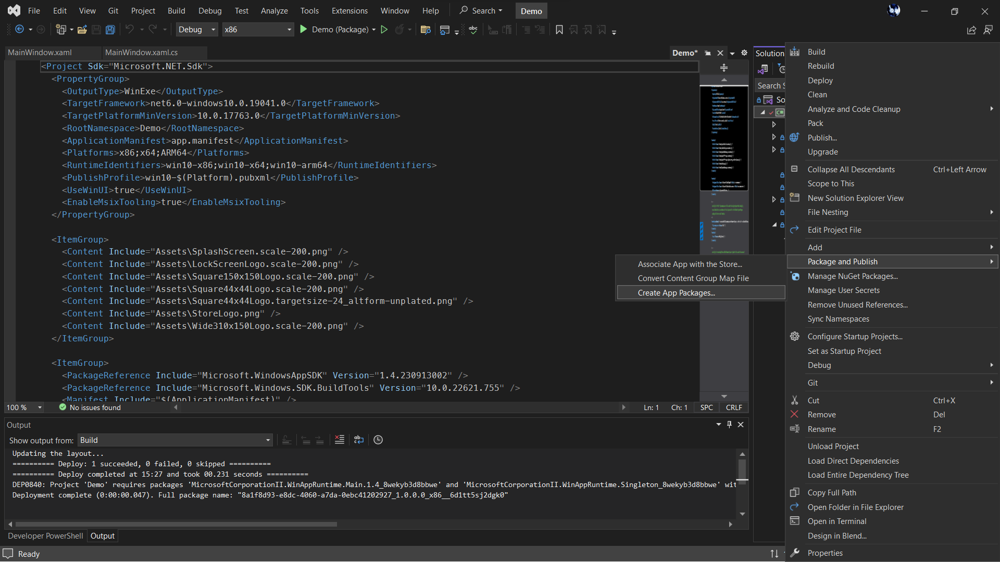
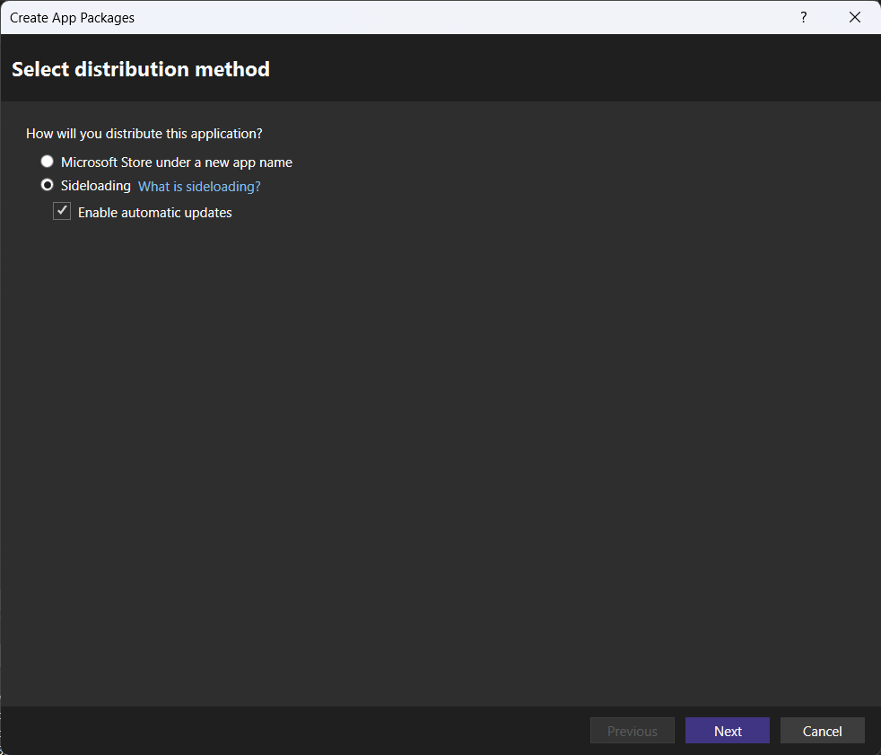
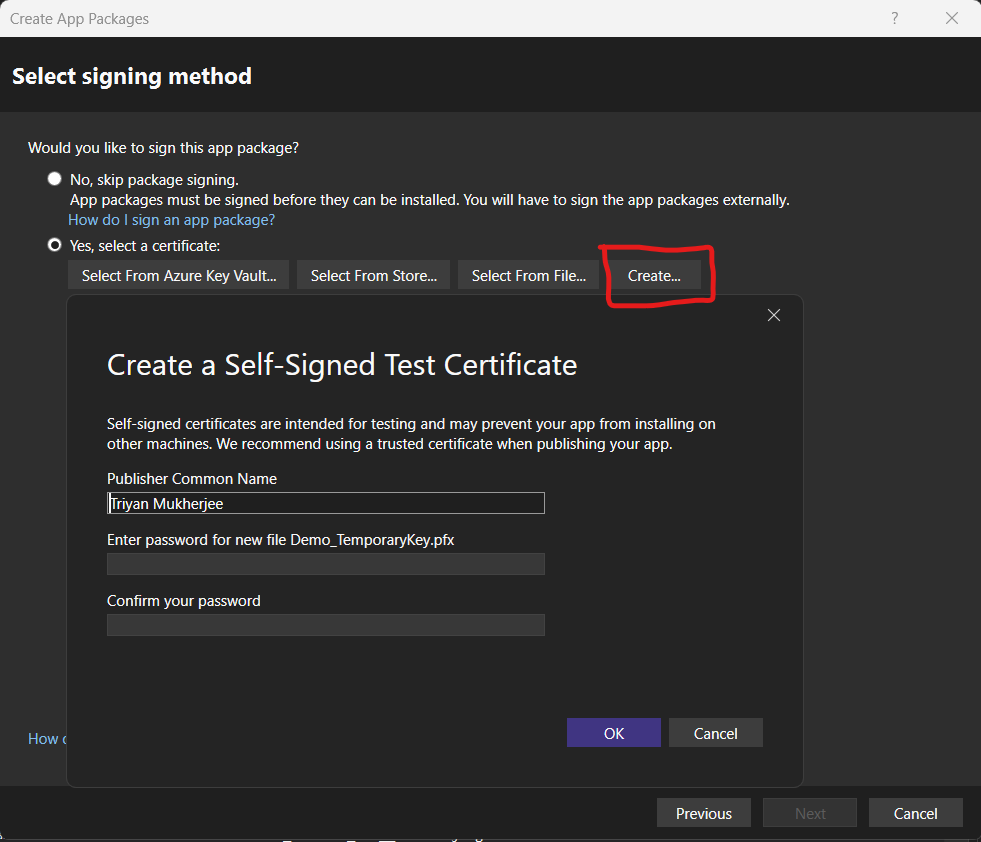
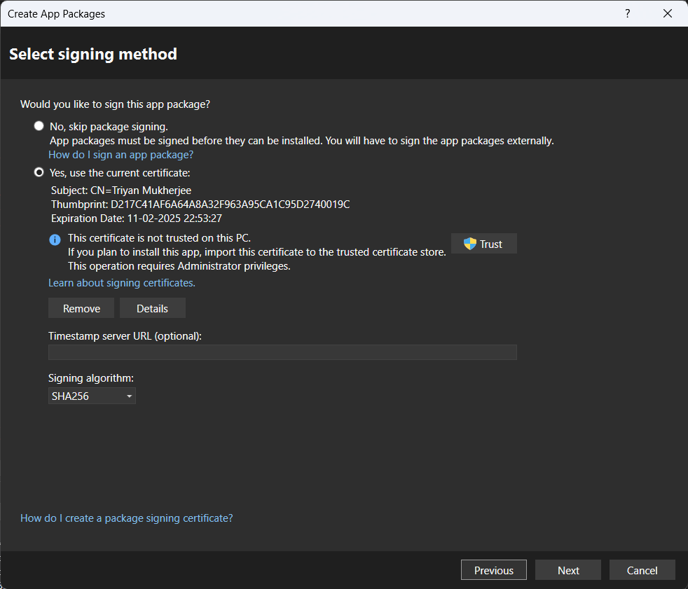
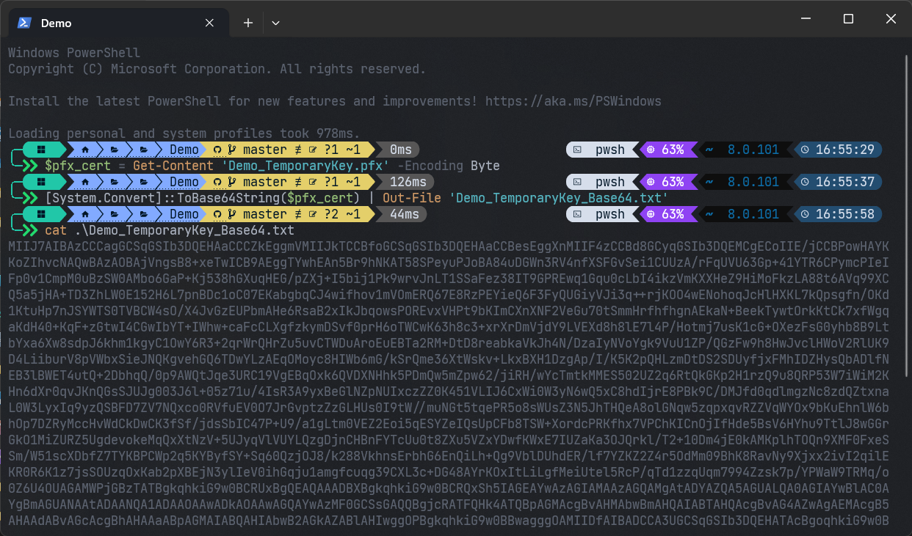
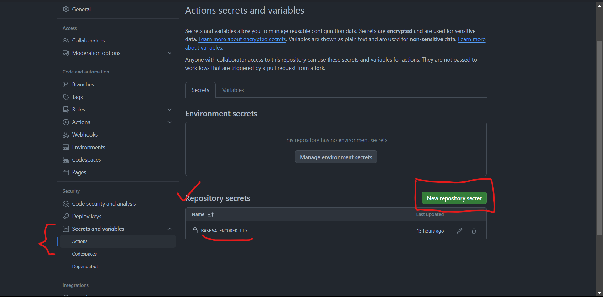

# Demo

Base WinUi App Setup.

## Setup Repository

You need to add a secret to your github repository to get the workflow actions up and working. Follow the given steps to do so:

- Right click on your solution folder and click `Package and Publish` > `Create App Packages...`



- For now during development we will use `sideloading` to distribute artifacts from builds and releases.



> [!NOTE]
> `SideLoading` here enables us to install the app on our local machine without the need of a store. This is useful for development and testing purposes.

- Click `Create` and then `Yes, select a certificate` and then `Create` again. A pop-up will appear asking for a password. Leave it empty and click `OK`.



- Once the process is complete, It will show the following screen and a file named `<ProjectName>_TemporaryKey.pfx` will be created in your solution folder. Once you have the file, you can close the window by canceling the process.



- Now, you need to get a `Base64` encoded string of the certificate file. You can use the following command in windows powershell to get the `Base64` encoded string of the certificate file.

```powershell
$cert = Get-Content -Path "<ProjectName>_TemporaryKey.pfx" -Encoding Byte
[System.Convert]::ToBase64String($cert) | Out-File -FilePath "<ProjectName>_TemporaryKey.txt"
```



> [!NOTE]
> Replace `<ProjectName>` with your project name. The above command will create a file named `<ProjectName>_TemporaryKey.txt` in your solution folder.

- Now that you have the `Base64` encoded string of the certificate file, you need to add it as a secret to your github repository. Follow the given steps to do so:

  - Go to your repository on github and click on `Settings` > `Secrets` > `New repository secret`.
  - Add a secret with the name `BASE64_ENCODED_PFX` and paste the `Base64` encoded string of the certificate file in the value field.
  - Click `Add secret` to save the secret.
  - Now, the secret is added to your repository and the workflow actions will be able to use it.



Once you have completed all the above steps, you can now delete the certificate file and the `Base64` encoded string of the certificate file from your solution folder. Do not commit the certificate file or the `Base64` encoded string of the certificate file to your repository.